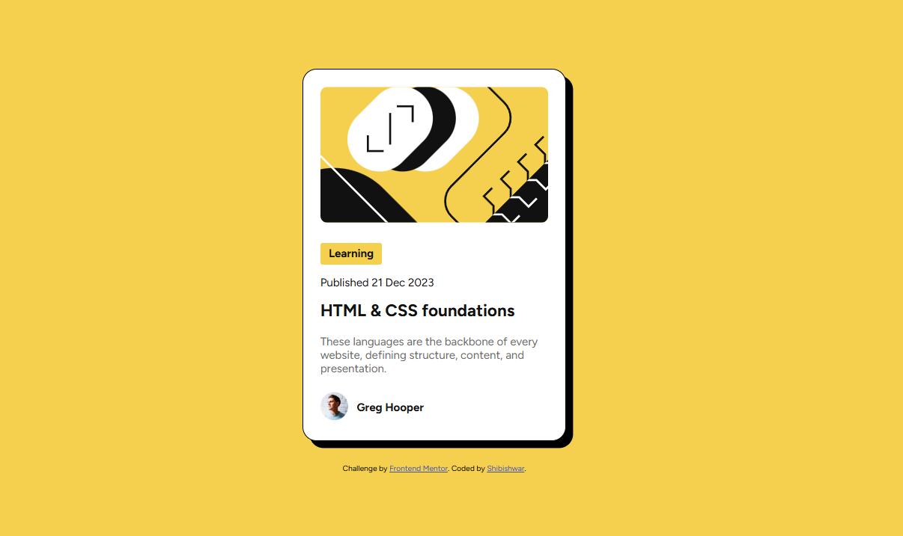

# Frontend Mentor - Blog preview card solution

This is a solution to the [Blog preview card challenge on Frontend Mentor](https://www.frontendmentor.io/challenges/blog-preview-card-ckPaj01IcS). Frontend Mentor challenges help you improve your coding skills by building realistic projects.

## Table of contents

- [Overview](#overview)
  - [Screenshot](#screenshot)
  - [Links](#links)
  - [Built with](#built-with)

## Overview

### Screenshot

### Links

- Solution URL: https://github.com/shibishwar/frontend-mentor-blog-preview-card.git
- Live Site URL: https://frntmentor-blog-preview-card.netlify.app/

### Built with

- Semantic HTML5 markup
- CSS custom properties
- Mobile-first workflow
